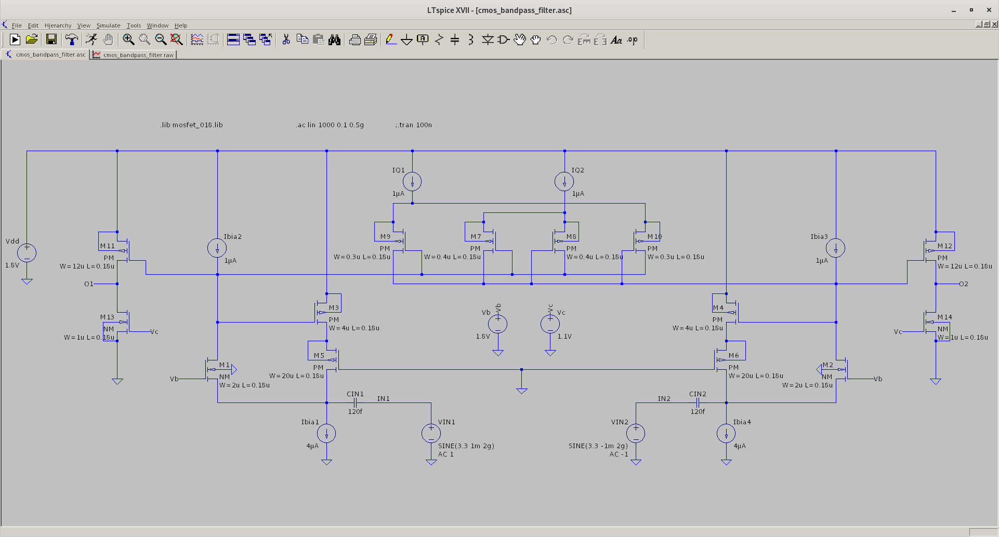
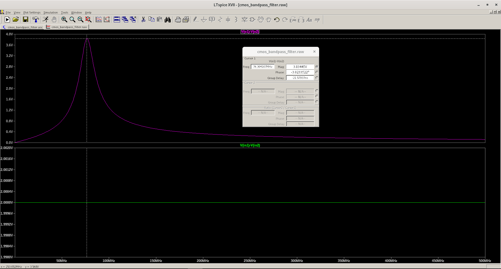

# active_bandpass_filter
A CMOS bandpass filter inspired by [A Fully Integrated CMOS Active Bandpass Filter for Multiband RF Front-Ends](https://sci-hub.do/https://ieeexplore.ieee.org/document/4584436)

TODO : 

1. Decrease the high power consumption (45uW) without affecting much on the gain
2. Determine the mathematical expression for deriving the bandpass cutoff frequency more precisely
